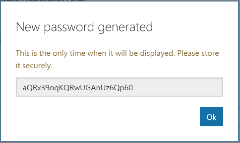

# Getting Started with the Microsoft Graph Outlook Mail API and Java

The sample code in this repository is the end result of going through the [Java tutorial on the Outlook Dev Center](https://docs.microsoft.com/en-us/outlook/rest/java-tutorial). If you go through that tutorial yourself, you should end up with code very similar to this. If you download or fork this repository, you'll need to follow the steps in [Configure the sample](#configure-the-sample) to run it.

> **NOTE:** Looking for the version of this tutorial that used the Outlook API directly instead of Microsoft Graph? Check out the `outlook-api` branch. Note that Microsoft recommends using the Microsoft Graph to access mail, calendar, and contacts. You should use the Outlook APIs directly (via https://outlook.office.com/api) only if you require a feature that is not available on the Graph endpoints.

## Prerequisites

- Java Development Kit 8.
- Spring Tool Suite

## Register the app

Head over to https://apps.dev.microsoft.com to quickly get a application ID and password. Click the **Sign in** link and sign in with either your Microsoft account (Outlook.com), or your work or school account (Office 365).

Once you're signed in, click the **Add an app** button. Enter `java-tutorial` for the name and click **Create application**. After the app is created, locate the **Application Secrets** section, and click the **Generate New Password** button. Copy the password now and save it to a safe place. Once you've copied the password, click **Ok**.

Locate the **Platforms** section, and click **Add Platform**. Choose **Web**, then enter `http://localhost:8080/authorize.html` under **Redirect URIs**.

> **NOTE:** The values in **Redirect URIs** are case-sensitive, so be sure to match the case!

Click **Save** to complete the registration. Copy the **Application Id** and save it along with the password you copied earlier. We'll need those values soon.

Here's what the details of your app registration should look like when you are done.

## Configure the sample

1. Open the `./src/main/resources/auth.properties` file.
1. Replace `YOUR_APP_ID_HERE` with the **Application Id** from the registration you just created.
1. Replace `YOUR_APP_PASSWORD_HERE` with the password you copied earlier.
1. Right-click the project and choose **Run as**, then **Maven build**.

## Copyright ##

Copyright (c) Microsoft. All rights reserved.

----------
Connect with me on Twitter [@JasonJohMSFT](https://twitter.com/JasonJohMSFT)